# NETFLIX TV SHOWS AND MOVIES ANALYSIS

**Data & Strategy Analysis**

**By: Tien Vương Nguyen**

---

## PROJECT PURPOSE

As a competitor to Netflix, I firmly believe that understanding their trends in movies and series is crucial to understanding their customers. Netflix has its own dedicated Data Department to execute and secure its dominance in the minds of viewers. Therefore, analyzing their content over the years can provide valuable insights into their strategy and customer preferences.

---

## TABLE OF CONTENTS

### Short-Term Strategy
- Content Type Distribution
- Content Growth Trends
- Key Directors and Genres (Figures 1–4)
- Top Casts and Audience Appeal (Figure 5–6)

### Next Few Years Strategy
- Director-Genre Alignment (Figure 7)
- Cast-Genre Alignment (Figure 8)
- Time Gap Reduction Strategy (Figure 9–10)
- Duration Analysis
- Movie Length and TV Show Seasons (Figure 11–12) trend Over Years

### Long-Term Strategy
- Focus on Underserved Markets
- Collaborate with Local Directors
- Explore Niche Genres (Figure 13–14)
- Time Series Analysis
- Monthly/Yearly Content Trends (Figure 15)

### Recommendation System
- TF-IDF Content-Based Filtering
- Embedding-Based Semantic Filtering

---

## SHORT-TERM STRATEGY

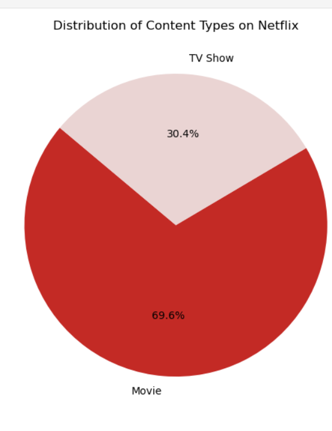

**Figure 1. Distribution of Content Types on Netflix**  

Movies dominate Netflix's overall content library, comprising **69.6%**, while TV shows account for **30.4%**. In the initial stage, we can acquire the copyrights for movies and TV shows following a similar ratio to ensure we secure a portion of Netflix's market share across both content types.

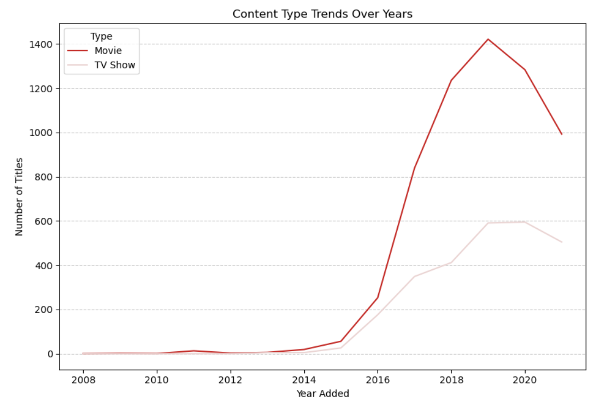

**Figure 2. Content Type Trends**  

Movie additions grew explosively from 2016 to 2019, peaking at over 1,400 titles in 2019, before declining sharply in 2020–2021. TV show additions, however, showed steady and consistent growth. This suggests Netflix shifted focus toward building a stronger TV series catalog after the movie boom. As a competitor, we should balance aggressive movie licensing with stable TV series investment to reduce risk.

By investing in both movies and TV shows, we can balance rapid growth potential with long-term stability, reducing overall risk.

---

## INITIAL APPROACH

**Figure 3. Top 15 Directors by Number of Titles Produced**

| ID | Name                  | Count | Country         |
|----|-----------------------|-------|-----------------|
| 0  | Rajiv Chilaka         | 19    | India           |
| 1  | Raúl Campos           | 18    | Mexico          |
| 2  | Marcus Raboy          | 16    | United States   |
| 3  | Suhas Kadav           | 16    | India           |
| 4  | Jay Karas             | 14    | United States   |
| 5  | Cathy Garcia-Molina   | 13    | Philippines     |
| 6  | Martin Scorsese       | 12    | United States   |
| 7  | Jay Chapman           | 12    | United States   |
| 8  | Youssef Chahine       | 12    | Egypt           |
| 9  | Steven Spielberg      | 11    | United States   |
| 10 | Don Michael Paul      | 10    | United States   |
| 11 | David Dhawan          | 9     | India           |
| 12 | Troy Miller           | 8     | United States   |
| 13 | Yılmaz Erdoğan        | 8     | Turkey          |
| 14 | Quentin Tarantino     | 8     | United States   |

Rajiv Chilaka (19 titles) and Raúl Campos (18 titles) are the most prolific directors. Many top directors are from India and the United States. Acquiring content from these high-volume creators, especially in high-demand genres, will allow us to rapidly populate our library with proven, popular titles.

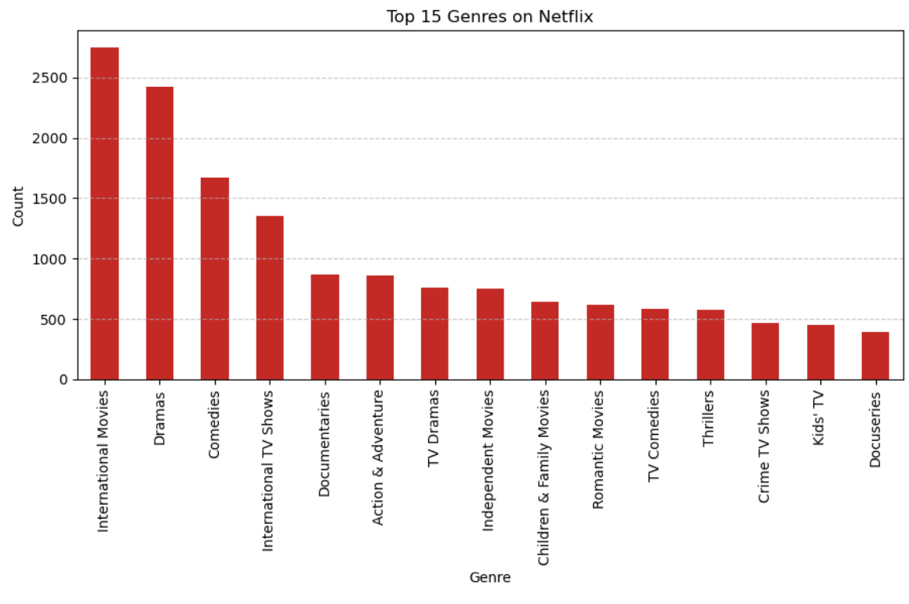

**Figure 4. Top 15 Popular Genres of 2021**  

Dramas, International Movies, and Comedies are the three most dominant genres. International TV Shows and Documentaries also rank highly. Focusing on these top-performing genres in the short term will help us capture the largest possible audience share quickly.
---

## TOP CASTS

**Figure 5. Top 15 Casts by Number of Titles Attended**

| ID | Cast                  | Count | Country                  |
|----|-----------------------|-------|--------------------------|
| 0  | Anupam Kher           | 43    | India                    |
| 1  | Shah Rukh Khan        | 35    | India                    |
| 2  | Julie Tejwani         | 33    | India                    |
| 3  | Takahiro Sakurai      | 32    | Japan                    |
| 4  | Naseeruddin Shah      | 32    | India                    |
| 5  | Rupa Bhimani          | 31    | India                    |
| 6  | Akshay Kumar          | 30    | India                    |
| 7  | Om Puri               | 30    | India                    |
| 8  | Yuki Kaji             | 29    | Japan                    |
| 9  | Amitabh Bachchan      | 28    | India                    |
| 10 | Paresh Rawal          | 28    | India                    |
| 11 | Boman Irani           | 27    | India                    |
| 12 | Rajesh Kava           | 26    | India                    |
| 13 | Vincent Tong          | 26    | Hong Kong, Canada, US    |
| 14 | Andrea Libman         | 25    | United States, Canada    |

Indian actors dominate the top cast list, with Anupam Kher appearing in 43 titles and Shah Rukh Khan in 35 titles. This shows strong audience pull from star power, particularly from Bollywood. Acquiring content featuring these popular actors will significantly boost initial user engagement.

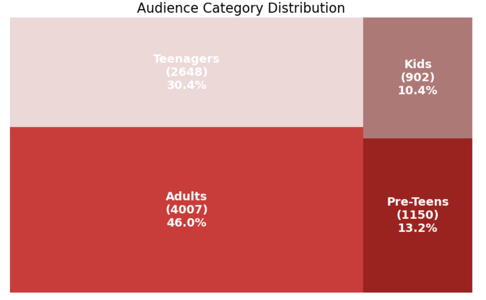

**Figure 6. Audience Category Distribution**  

Adults account for 46% of content, Teenagers 30.4%, Pre-Teens 13.2%, and Kids only 10.4%. The relatively low share of Kids and Pre-Teens content indicates clear underserved segments where a new platform can differentiate itself and build long-term family loyalty.

---

## NEXT FEW YEARS STRATEGY

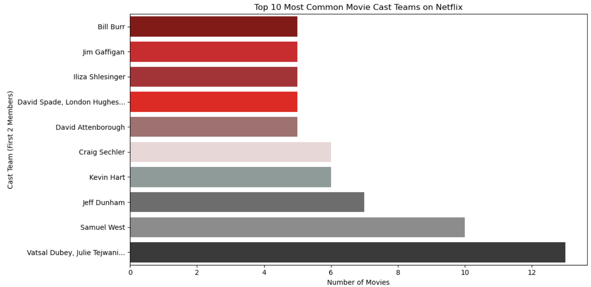

**Figure 7. Most Popular Casts Team**  

Rajiv Chilaka leads strongly in Children & Family Movies, David Dhawan excels in Comedies, and Cathy Garcia-Molina shows versatility across TV Dramas and Romantic Movies. This clear director-genre alignment suggests we should partner with these directors in their strongest genres to maximize hit probability.
---

## TIME GAP ANALYSIS

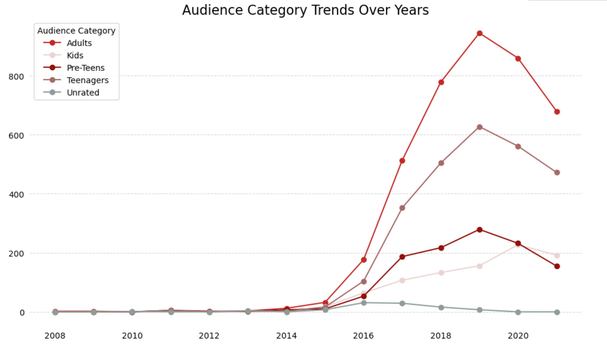

**Figure 8. Audience Category Over Years**  

Adult and Teenager content grew rapidly after 2016, while Kids content grew more slowly. This gap creates a strategic opportunity for us to invest more heavily in children’s and family content, an area where Netflix is relatively weaker.

---

## DURATION ANALYSIS

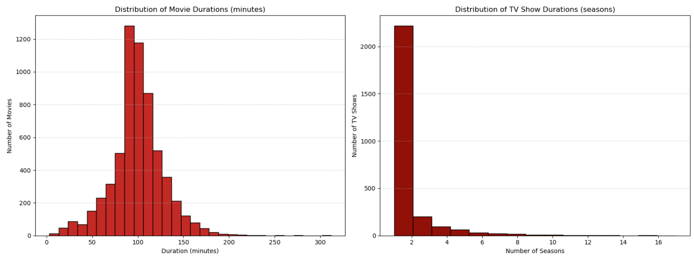

**Figure 9. Duration (Movie) and Seasons (TV Show) Distribution**

The majority of movies are 80–110 minutes long, while most TV shows have only 1–2 seasons. These patterns reflect strong audience preference for shorter, binge-friendly content. We should use these durations as benchmarks when licensing or producing new titles.

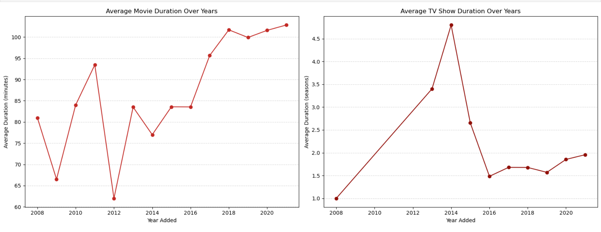

**Figure 10. Duration (Movie) and Seasons (TV Show) Over Years**  

Average movie runtime has stabilized around 100 minutes since 2018. TV shows show a slight upward trend in season count. Matching these viewer-preferred lengths will help improve completion rates and user satisfaction on our platform.

---

## LONG-TERM STRATEGY

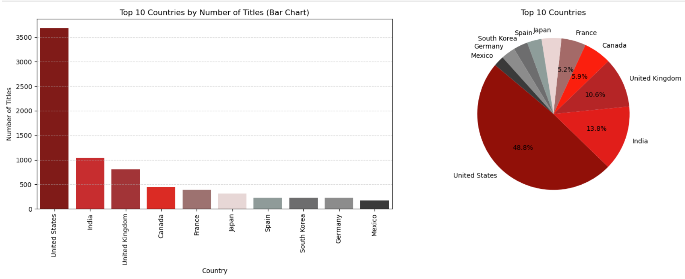

**Figure 11. Netflix Product Distribution**

The United States contributes over 3,500 titles, followed by India with around 1,000 titles. Many countries (especially in Latin America, Africa, and Southeast Asia) have very low representation. This heavy concentration reveals significant underserved international markets.

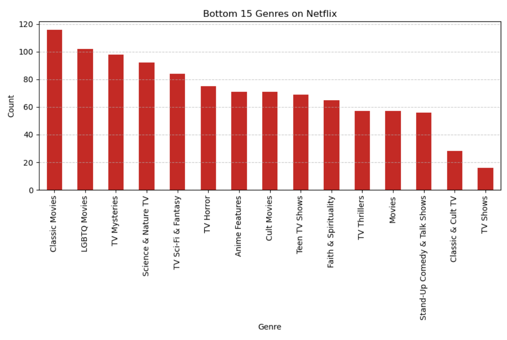

**Figure 12. Bottom 15 Popular Genres on Netflix**  

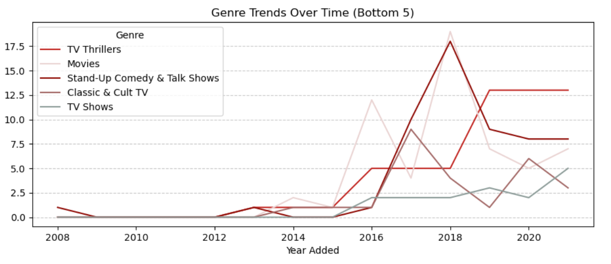

**Figure 13. Bottom 15 Genres Trends on Netflix**  

**Explore Niche Genres**: Experiment with underrepresented genres to differentiate our content offering.

Genres such as Classic Movies, LGBTQ Movies, TV Mysteries, Science & Nature TV, TV Sci-Fi & Fantasy, and Faith & Spirituality are significantly underrepresented. These niche areas offer low competition and high differentiation potential.

**Explore Niche Genres**: Experiment with underrepresented genres to create unique hits and establish a distinct brand identity.

---

## TIME SERIES ANALYSIS

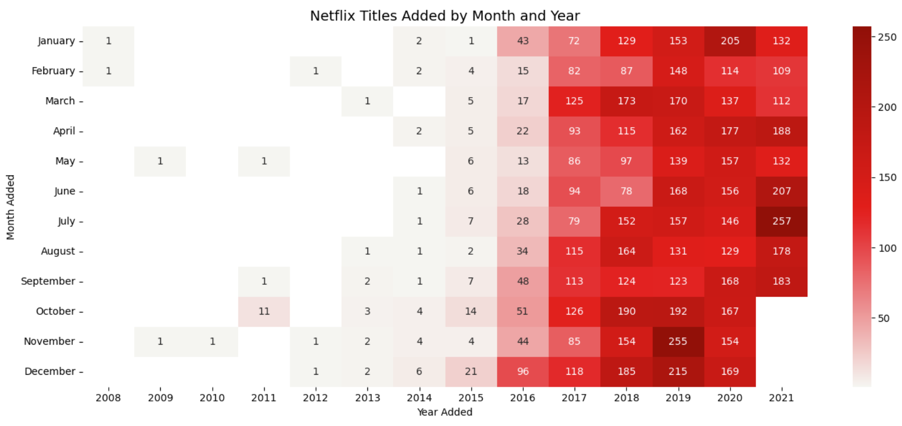

**Figure 14. Month and Year Added Heatmap**  

Content additions surged from 2016 onward, peaking in 2019–2020. July was the busiest month (especially 257 titles in July 2020), followed by December, October, and November. These seasonal patterns are consistent across recent years.

**Monthly Peaks**:  
- July – highest in 2020 (257 titles)  
- December – consistently high across 2018–2020  
- October and November – also strong, especially in 2019

**Recommendation**: Plan major content releases between July and December to align with Netflix’s highest addition periods and maximize subscriber growth.

---

## RECOMMENDATION SYSTEM

**Proposed Machine Learning Algorithm: K-Nearest Neighbors (KNN) for User-Based Movie Recommendation**

We propose a **Content-Based KNN Recommendation System** that recommends movies **of the same type/genre** as those the user has watched or liked.

### How the Algorithm Works:
1. Convert each movie’s genres (`listed_in`) into numerical vectors using One-Hot Encoding.
2. For any movie the user likes, find the **K nearest neighbors** based on genre similarity (using cosine distance).
3. Recommend the top K most similar movies sharing the same or highly overlapping genres.

**Advantages**:
- Works with your current dataset (no user ratings needed)
- Simple, fast, and interpretable
- Focuses on recommending movies of the **same type**

**Example of Recommendation (for user who liked "Squid Game")**:

| Rank | Recommended Movie                  | Genres Similarity                  |
|------|------------------------------------|------------------------------------|
| 1    | Money Heist                        | TV Dramas, TV Thrillers, International |
| 2    | Narcos                             | Crime TV Shows, TV Dramas          |
| 3    | The Night Manager                  | TV Dramas, International           |
| 4    | Elite                              | TV Dramas, Teen TV Shows           |
| 5    | Dark                               | TV Dramas, TV Mysteries            |

This KNN-based system ensures high relevance by recommending content that matches the user’s preferred genres. In the future, we can upgrade it into a hybrid model by adding user watch history and ratings.

---

**Dataset**: `netflix_data_study_case.csv` (8,807 titles)  
**Tools used**: Python, pandas, scikit-learn (KNN), matplotlib, seaborn  
**Analysis date**: March 2026

**Ready to compete.**  
